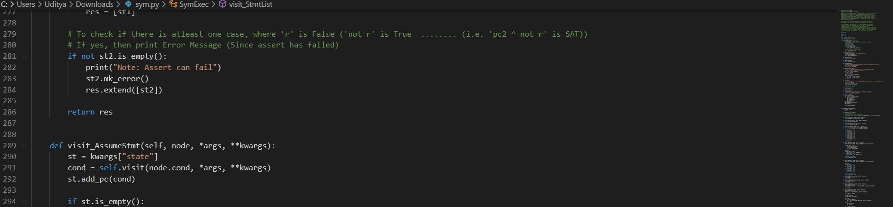
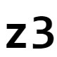
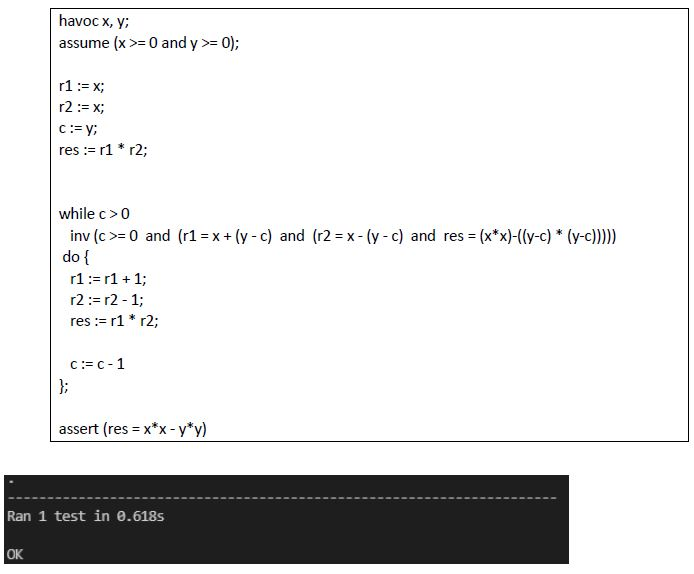

<!-- Reference:
https://github.com/othneildrew/Best-README-Template -->

<!-- PROJECT LOGO -->
 

  <h1><i>VeriCross</i></h1>

  
  
  .

  

    An automated Program Verification Engine for Imperative Language !
  

 

<!-- TABLE OF CONTENTS -->

  
Table of Contents

  <ol>
    <li><a href="#about-the-project">About The Project</a></li>
    <li><a href="#built-with">Built With</a></li>
    <li><a href="#getting-started">Getting Started</a></li>
    <li><a href="#sample-runs">Sample Runs</a></li>
    <li><a href="#license-or-author">License or Author</a></li>
    <li><a href="#contact">Contact</a></li>
    <li><a href="#acknowledgments">Acknowledgments</a></li>
  </ol>

 

<!-- ABOUT THE PROJECT -->
## About The Project
  *	VeriCross is a custom Program Verification Engine to prove correctness using specifications & constructs like loop invariants.
  *	The tool makes deductive analysis possible with over pinpoint accuracy.

  
(<a href="#readme-top">back to top</a>)

## Built With
  &nbsp; &nbsp; &nbsp;  &nbsp; &nbsp; &nbsp; &nbsp; &nbsp; &nbsp; &nbsp;  &nbsp; &nbsp; &nbsp; &nbsp; &nbsp; &nbsp; 

  &nbsp; &nbsp; &nbsp; &nbsp; &nbsp; <b><i> Python </i></b> &nbsp; &nbsp; &nbsp; &nbsp; &nbsp; &nbsp; &nbsp; &nbsp; &nbsp; &nbsp; &nbsp; &nbsp; &nbsp; <b><i> TatSu </i></b> &nbsp; &nbsp; &nbsp; &nbsp; &nbsp; &nbsp; &nbsp; &nbsp; &nbsp; &nbsp;&nbsp; <b><i> z3 Solver </i></b>

  
(<a href="#readme-top">back to top</a>)

<!-- GETTING STARTED -->
## Getting Started
  #### Prerequisites
  * Python
  * TatSu, Coverage
  * z3 Solver (Microsoft)
  * Machine Requirements: Minimum 4GB RAM, Intel i5 Processor (or Equivalent)

  
  #### Setup & Use
  The program takes a WLang program as input and performs Verification on it.
  1. Create a file with WLang program.
  2. Run 'wlang/sym.py' in python with the path of file (from Part-1) as argument.

  
(<a href="#readme-top">back to top</a>)

<!-- Sample Runs -->
## Sample Runs
  * We tried VeriCross on some interesting programs. And it was able to successfully verify all the them.
  * All the tries test cases and programs can be found in:
    1. 'wlang/q4b.prg'
    2. 'wlang/q4d.prg'
    3. 'wlang/test_sym.py'

  * ##### Example: Computing (x2 - y2) using the form '(x-y) * (x+y)':
    

    * As we can see, no assertion errors were raised. Hence the invariant correctly verifies the program and is good enough to prove the post-condition.

  
(<a href="#readme-top">back to top</a>)

<!-- LICENSE -->
## License or Author
  * Uditya Laad - (University of Waterloo)

  
(<a href="#readme-top">back to top</a>)

<!-- CONTACT -->
## Contact
  <b>Uditya Laad</b> &nbsp; [@linkedin.com/in/uditya-laad-222680148](https://www.linkedin.com/in/uditya-laad-222680148/)
  
  &nbsp; &nbsp; &nbsp; &nbsp; &nbsp; &nbsp; &nbsp; &nbsp; &nbsp; &nbsp; &nbsp; [@github.com/udityalaad](https://github.com/udityalaad)
  
  &nbsp; &nbsp; &nbsp; &nbsp; &nbsp; &nbsp; &nbsp; &nbsp; &nbsp; &nbsp; &nbsp; udityalaad123@gmail.com

  <b>Project Link</b> &nbsp; [https://github.com/udityalaad/VeriCross](https://github.com/udityalaad/VeriCross)

  
(<a href="#readme-top">back to top</a>)

<!-- ACKNOWLEDGMENTS -->
## Acknowledgments
  * ECE 653 - Assignment 3, Prof. Arie Gurfinkel, Prof. Patrick Lam, University of Waterloo

  
(<a href="#readme-top">back to top</a>)

